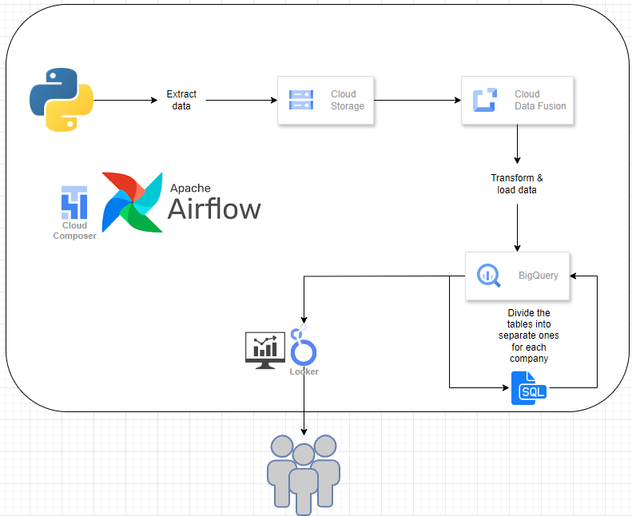
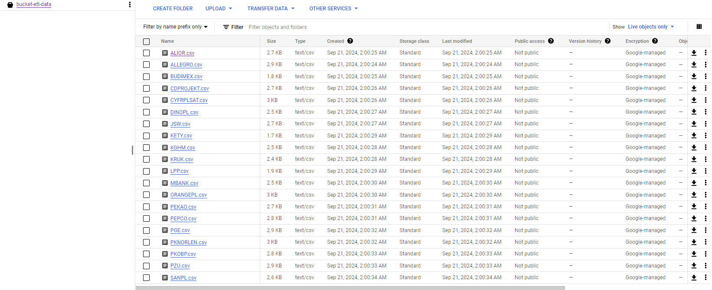
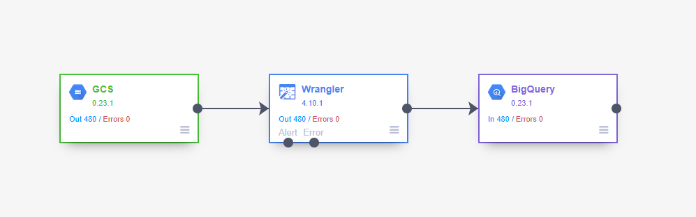
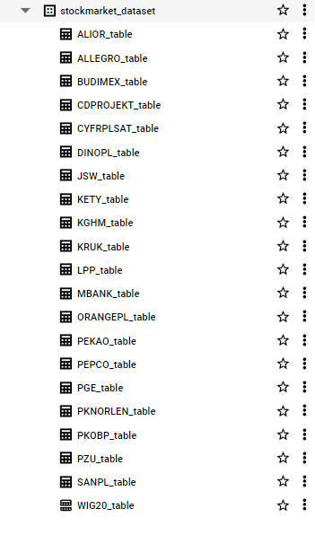
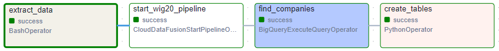

PROJECT ONGOING




<details>
  <summary>(Python code for data extract)</summary>
  
```python
import yfinance as yf
from google.cloud import storage


class DataScraper:
    def __init__(self, ticker):
        self.ticker = ticker
        self.df = None
        self.engine = None
        self.info = None
        self.stock = None

    def choose_stock(self):
        self.stock = yf.Ticker(self.ticker)
        self.get_stock_info()
        return self.stock
    
    def scrap_df(self, start_date=None, end_date=None):
        self.df = self.stock.history(start=start_date, end=end_date)
        self.df.reset_index(inplace=True)
        print(f"Dataframe for -{self.ticker}- created for:\nStart date: {start_date}\nEnd date: {end_date}")
        return self.df
    
    def get_stock_info(self):
        self.info = self.stock.info
        return self.info

    def set_engine(self, engine):
        self.engine = engine
        return self.engine

    def add_df_to_sql(self):
        self.df.to_sql(name=self.ticker, con=self.engine, if_exists='replace', index=False)
        return print(f"{self.info['shortName']} added to database\n")

    def insert_column_with_filename(self):
        self.df.insert(0, 'ticker_name', f"{DS_obj.info['shortName']}", allow_duplicates=True)
        return self.df
    
class GCPUploader:
    def __init__(self, bucket_name, source_file_name, destination_blob_name):
        self.bucket_name = bucket_name
        self.source_file_name = source_file_name
        self.destination_blob_name = destination_blob_name
        
        # Upload the CSV file to a GCS bucket
    def upload_to_gcs(self):
        storage_client = storage.Client()
        bucket = storage_client.bucket(self.bucket_name)
        blob = bucket.blob(self.destination_blob_name)

        blob.upload_from_filename(self.source_file_name)

        print(f'File {self.source_file_name} uploaded to {self.destination_blob_name} in {self.bucket_name}.')


    
if __name__ == '__main__':
        
    ticker_list = ['ALE.WA','ALR.WA','BDX.WA','CDR.WA','CPS.WA','DNP.WA','JSW.WA','KGH.WA','KRU.WA','KTY.WA','LPP.WA','MBK.WA','OPL.WA','PCO.WA','PEO.WA','PGE.WA','PKN.WA','PKO.WA','PZU.WA','SPL.WA']
    for ticker in ticker_list:
        DS_obj = DataScraper(ticker)
        DS_obj.choose_stock()
        DS_obj.scrap_df()
        DS_obj.insert_column_with_filename()
        DS_obj.df.to_csv(f"{DS_obj.info['shortName']}.csv")
        GCPU_obj = GCPUploader('bucket-etl-data', f"{DS_obj.info['shortName']}.csv", f"{DS_obj.info['shortName']}.csv")
        GCPU_obj.upload_to_gcs()
```
</details>








<details>
  <summary>(DAG file for airflow engine)</summary>
  
```python
from airflow import DAG
from airflow.operators.bash import BashOperator
from airflow.providers.google.cloud.operators.datafusion import CloudDataFusionStartPipelineOperator
from airflow.providers.google.cloud.operators.bigquery import BigQueryExecuteQueryOperator
from airflow.operators.python import PythonOperator
from google.cloud import bigquery
from datetime import timedelta, datetime

# Parameters
PROJECT_ID = 'keen-quest-434917-s4'
DATASET_ID = 'stockmarket_dataset'
TABLE_ID = 'WIG20_table'

default_args = {
    'retries': 1,
    'retry_delay': timedelta(minutes=5),
    'execution_timeout': timedelta(seconds=500)
}

dag = DAG('market_data_run',
          default_args=default_args,
          description='Runs an external Python script',
          schedule_interval='@daily',
          start_date=datetime(2024, 9, 19),
          catchup=False
          )

# SQL task 1: Find unique companies
find_companies_query = f"""
    SELECT DISTINCT ticker_name
    FROM `{PROJECT_ID}.{DATASET_ID}.{TABLE_ID}`;
"""

find_companies = BigQueryExecuteQueryOperator(
    task_id='find_companies',
    sql=find_companies_query,
    use_legacy_sql=False,
    dag=dag,
)

# Python script for table creation per company
def create_company_tables():
    client = bigquery.Client()
    query = f"""
        SELECT DISTINCT ticker_name
        FROM `{PROJECT_ID}.{DATASET_ID}.{TABLE_ID}`
    """
    query_job = client.query(query)
    tickers = [row['ticker_name'] for row in query_job]

    for ticker in tickers:
        create_table_query = f"""
            CREATE OR REPLACE TABLE `{PROJECT_ID}.{DATASET_ID}.{ticker}_table` AS
            SELECT *
            FROM `{PROJECT_ID}.{DATASET_ID}.{TABLE_ID}`
            WHERE ticker_name = '{ticker}';
        """
        client.query(create_table_query)

# SQL task 2: Creating table for each company
create_tables_task = PythonOperator(
    task_id='create_tables',
    python_callable=create_company_tables,
    dag=dag,
)

# Run external Python script
run_script_task = BashOperator(
    task_id='extract_data',
    bash_command='python /home/airflow/gcs/dags/scripts/data_scraper.py',
    dag=dag,
)

# Run pipeline Data Fusion
start_pipeline = CloudDataFusionStartPipelineOperator(
    location="europe-north1",
    pipeline_name="wig20_pipeline",
    instance_name="datafusion-dev",
    task_id="start_wig20_pipeline",
    pipeline_timeout=500,
    dag=dag
)

# Task order
run_script_task >> start_pipeline >> find_companies >> create_tables_task
```
</details>




